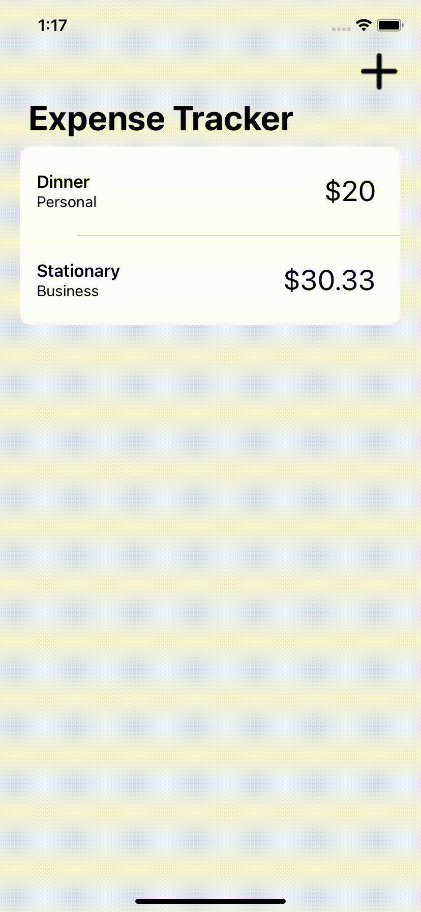
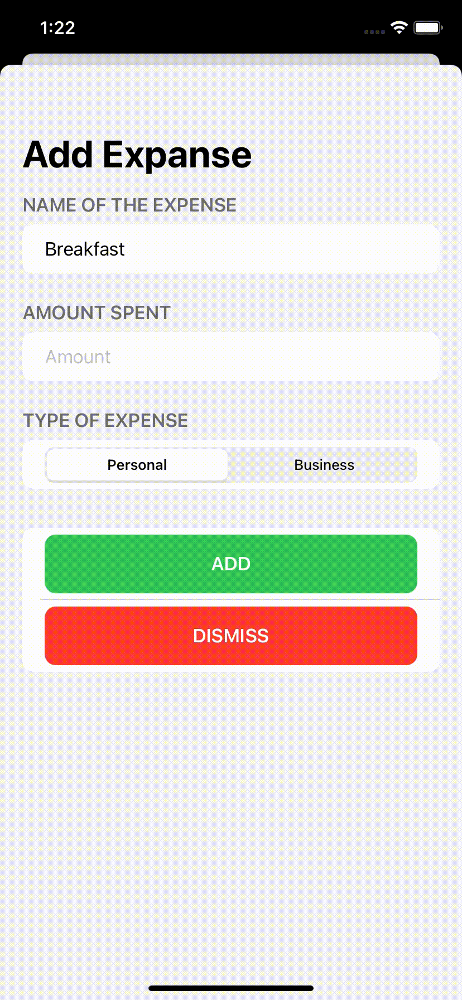

# Expense Tracking App
An Expense tracking app made with SwiftUI in MVVM pattern

## Add Expenses
<table>
  <tr>
    <td></td>
    <td></td>
  </tr>
</table>

## View Expense in Detail

## Data Persistence
Through Codable and UserDefaults

